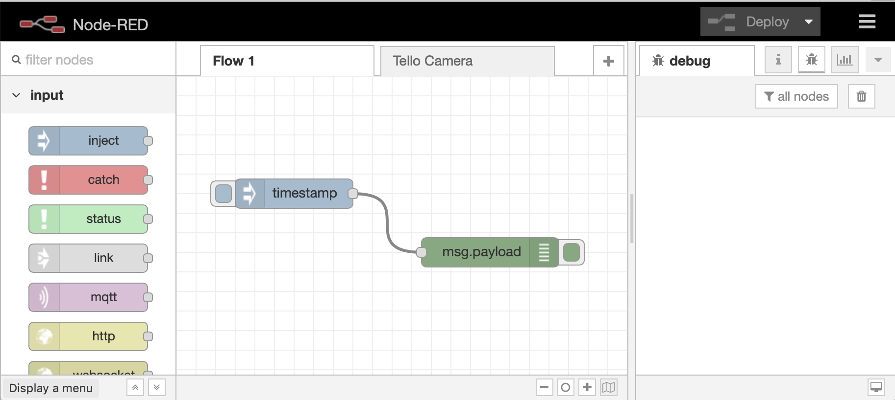

# Learn about Node-RED

**Node-RED** is a open source project and flow-based programming environment from the
[JS Foundation](https://js.foundation/community/projects). It provides a palette of nodes that allow users
to very quickly wire up IoT applications that can combine streams of both physical and digital events.
The [Node.JS](https://nodejs.org/) runtime is easy to install on both devices and the cloud, and provides a framework for extending its capabilities.

[Node-RED](https://nodered.org) applications, or flows, are created using a browser based editor served from the Node-RED runtime.  There is a palette of nodes installed out of the box, but there are a wealth of additional [nodes](https://flows.nodered.org/?type=node&num_pages=1) available to be installed to add additional capabilities to Node-RED.

Node-RED flows are created by dragging nodes from the pallet then connecting them in the editor.

To get started you need to setup your Node-RED environment in the IBM Cloud, so move to the [next section](PART2.md) and complete the setup.

---

[Home](/README.md) | **Node-RED** | [Setup](/PART2.md) | [Onyx](/PART3.md) | [Connect](/PART4.md) | [Speech](/PART5.md) | [Sentiment](/PART6.md) | [Tone](/PART7.md) | [NLU](/PART8.md) | [Translate](/PART9.md) | [SMS](/PART10.md) | [ChatBot](/PART11.md) | [Cloudant](/PART12.md) | [Map](/PART13.md) | [Blockchain](/PART14.md) 

---
