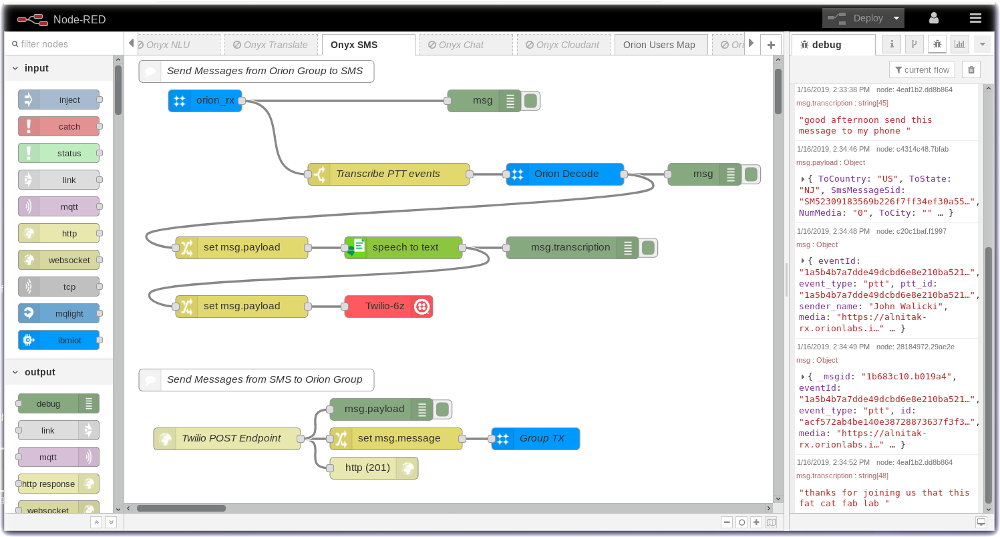

# Node-RED Example: Orion - Twilio SMS

In this section you will connect the Orion Onyx using **Node-RED** and the [node-red-contrib-orion](https://flows.nodered.org/node/node-red-contrib-orion) nodes to the Twilio SMS node.  The wav file will be transcribed into a text string and then the text will be sent to the Twilio SMS node. TXT messages to my Twilio phone number will be sent to the Onyx group. T

### Twilio integration with Onyx Messages

Download the [flow](flows/) and import it into your Node-RED Editor.

---

[Home](/README.md) | [Node-RED](/PART1.md) | [Setup](/PART2.md) | [Onyx](/PART3.md) | [Connect](/PART4.md) | [Speech](/PART5.md) | [Sentiment](/PART6.md) | [Tone](/PART7.md) | [NLU](/PART8.md) | [Translate](/PART9.md) | **SMS** | [ChatBot](/PART11.md) | [Cloudant](/PART12.md) | [Map](/PART13.md) | [Blockchain](/PART14.md) 

---
