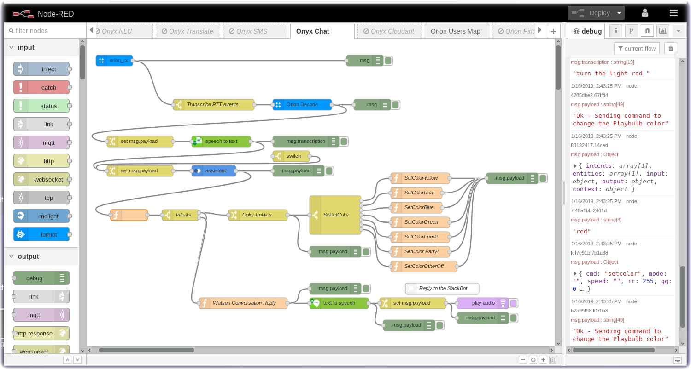

# Node-RED Example: Orion - Watson Assistant ChatBot

In this section you will connect the Orion Onyx using **Node-RED** and the [node-red-contrib-orion](https://flows.nodered.org/node/node-red-contrib-orion) nodes to the [Watson Assistant](https://cloud.ibm.com/docs/services/assistant/getting-started.html) node.  The wav file will be transcribed into a text string and then the text will be sent to the Watson Assistant chatbot node. This particular chatbot example controls a programmable light bulb but you can make the chatbot respond however you want.  There are some great chatbot examples on the [Bot Asset Exchange](https://developer.ibm.com/code/exchanges/bots/)

### Watson Assistant chatbot integration with Onyx Messages

Download the [flow](flows/nodered-onyx-chatbot.json) and import it into your Node-RED Editor.

---

[Home](/README.md) | [Node-RED](/PART1.md) | [Setup](/PART2.md) | [Onyx](/PART3.md) | [Connect](/PART4.md) | [Speech](/PART5.md) | [Sentiment](/PART6.md) | [Tone](/PART7.md) | [NLU](/PART8.md) | [Translate](/PART9.md) | [SMS](/PART10.md) | **ChatBot** | [Cloudant](/PART12.md) | [Map](/PART13.md) | [Blockchain](/PART14.md) 

---
