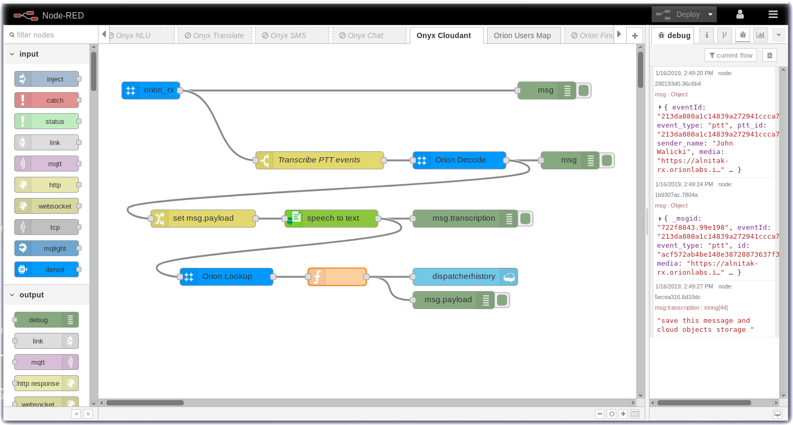

# Node-RED Example: Orion - IBM Cloudant Cloud Object Storage

In this section you will connect the Orion Onyx using **Node-RED** and the [node-red-contrib-orion](https://flows.nodered.org/node/node-red-contrib-orion) nodes to the Twilio SMS node.  The wav file will be transcribed into a text string and then the text, user and location data will be stored in a Cloudant database in the IBM Cloud.

### IBM Cloudant integration with Onyx Messages

Download the [flow](flows/) and import it into your Node-RED Editor.

---

[Home](/README.md) | [Node-RED](/PART1.md) | [Setup](/PART2.md) | [Onyx](/PART3.md) | [Connect](/PART4.md) | [Speech](/PART5.md) | [Sentiment](/PART6.md) | [Tone](/PART7.md) | [NLU](/PART8.md) | [Translate](/PART9.md) | [SMS](/PART10.md) | [ChatBot](/PART11.md) | **Cloudant** | [Map](/PART13.md) | [Blockchain](/PART14.md) 

---
