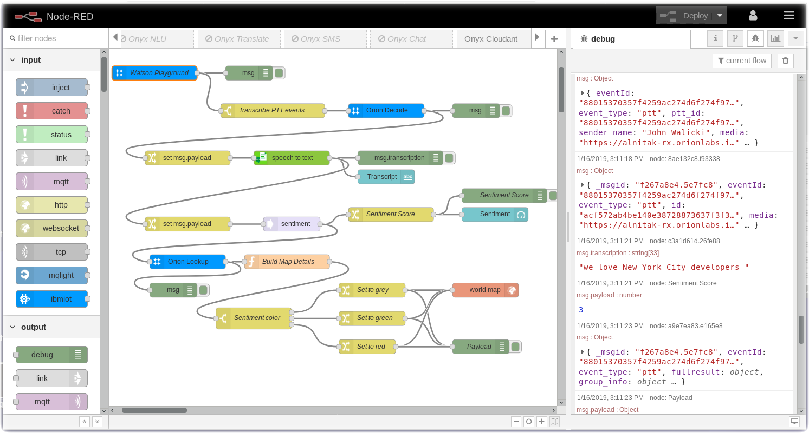
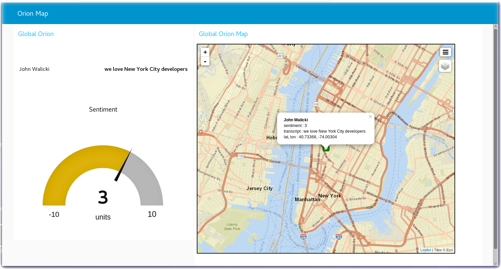

# Node-RED Example: Orion - User Map

In this section you will connect the Orion Onyx using **Node-RED** and the [node-red-contrib-orion](https://flows.nodered.org/node/node-red-contrib-orion) nodes to the Node-RED Dashboard and World map nodes.  The wav file will be transcribed into a text string and then the text will be sent to Sentiment Analysis. The Orion User info is queried for the GPS location.  A pin is dropped on a map and a gauge reports the sentiment.

### Map Location and Sentiment of the Onyx Users and Messages

Download the [flow](flows/) and import it into your Node-RED Editor. 

---

[Home](/README.md) | [Node-RED](/PART1.md) | [Setup](/PART2.md) | [Onyx](/PART3.md) | [Connect](/PART4.md) | [Speech](/PART5.md) | [Sentiment](/PART6.md) | [Tone](/PART7.md) | [NLU](/PART8.md) | [Translate](/PART9.md) | [SMS](/PART10.md) | [ChatBot](/PART11.md) | [Cloudant](/PART12.md) | **Map** | [Blockchain](/PART14.md) 

---
