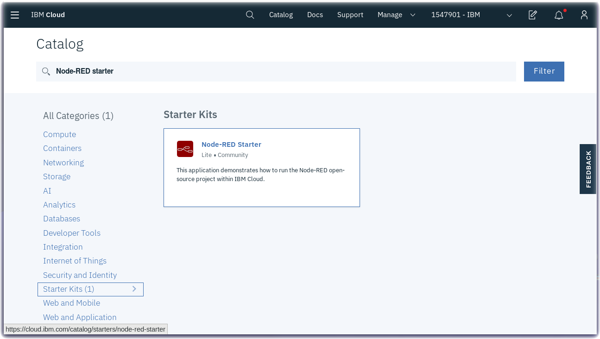
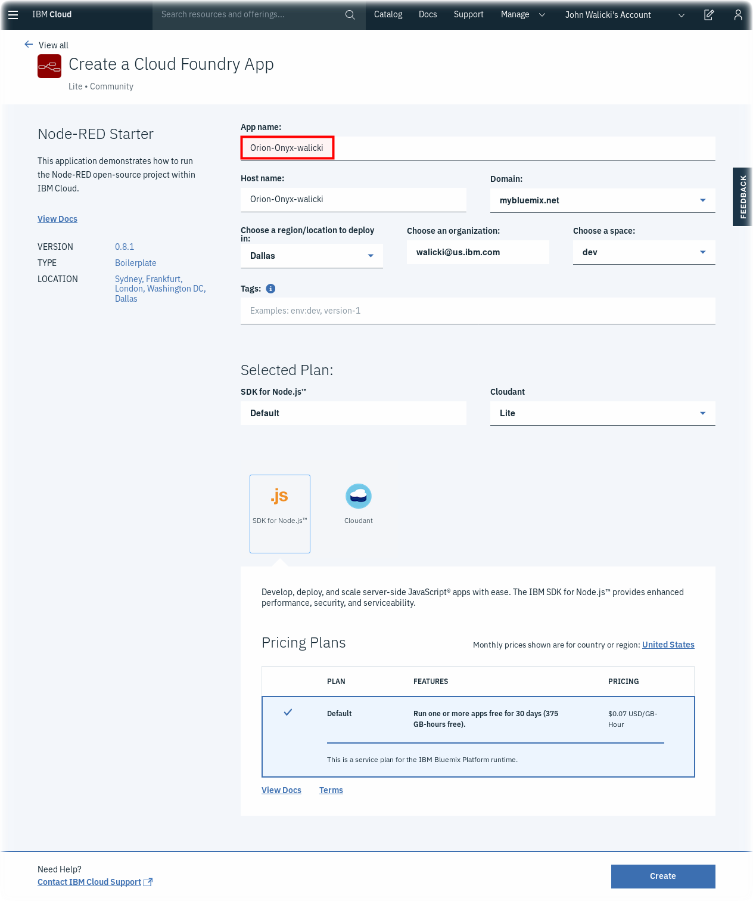
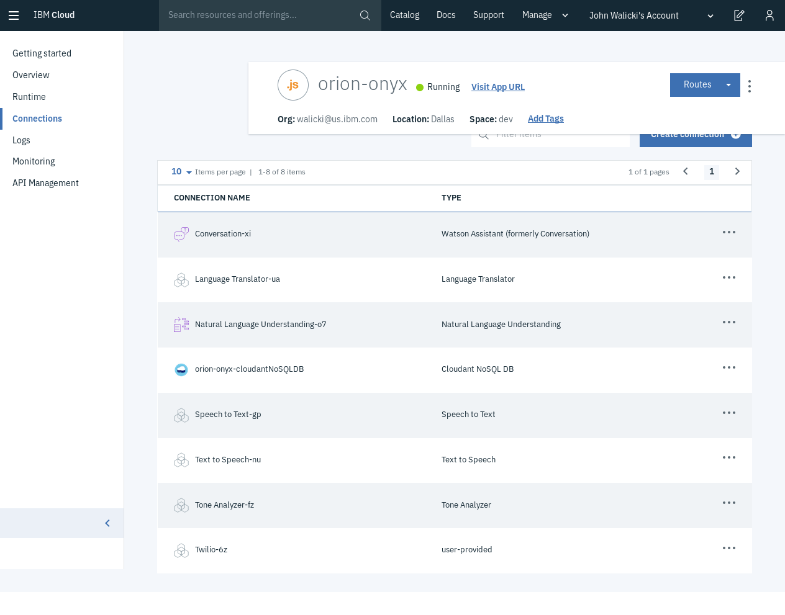

# Create an IBM Cloud Node-RED Web Starter

In this section, you will create a Node-RED Web Starter application in the IBM Cloud

## Prerequisites
- Register for a free [IBM Cloud](https://cloud.ibm.com/registration) Lite Account
- Log into [IBM Cloud](http://cloud.ibm.com)

## Create a Node-RED Starter application

- Search for **Node-RED** in the Starter Kits
- Create a [Node-RED Starter](https://console.bluemix.net/catalog/starters/node-red-starter) Cloud Foundry application instance 

- Name your Node-RED Starter **Orion-Onyx-\<yourname\>**

## Connect Watson AI Services

- Create the following free Watson AI services
  - [Speech to Text](https://cloud.ibm.com/catalog/services/speech-to-text)
  - [Text to Speech](https://cloud.ibm.com/catalog/services/text-to-speech)
  - [Watson Assistant](https://cloud.ibm.com/catalog/services/watson-assistant-formerly-conversation)
  - [Language Translator](https://cloud.ibm.com/catalog/services/language-translator)
  - [Natural Language Understanding](https://cloud.ibm.com/catalog/services/natural-language-understanding)
  - [Tone Analyzer](https://cloud.ibm.com/catalog/services/tone-analyzer)
  - [Twilio](https://cloud.ibm.com/catalog/services/twilio-programmable-sms)
- Connect Watson AI services (Don't restage them individually, restage after connecting all of them to your Node-RED Starter)
- On the Node-RED Starter Application page, select **Connections**  Click on the **Create connection** button. Bind your Watson AI services.
  - Speech to Text
  - Text to Speech
  - Watson Assistant
  - Language Translator
  - Natural Language Understanding
  - Tone Analyzer
  - Twilio

## Add Additional Node-RED Nodes

Once Node-RED is installed, several additional Node-RED nodes will be necessary. Install the following nodes using the [Node-RED Manage Palette](https://github.com/binnes/esp8266Workshop/blob/master/en/part3/NODERED.md#step-3---how-to-install-additional-node-red-nodes) or via the npm command line:

- [node-red-dashboard](https://flows.nodered.org/node/node-red-dashboard) - A set of dashboard nodes for Node-RED
- [node-red-contrib-web-worldmap](https://flows.nodered.org/node/node-red-contrib-web-worldmap) - A Node-RED node for plotting things on a world map
- [node-red-contrib-orion](https://flows.nodered.org/node/node-red-contrib-orion) - Node-RED nodes to decode and encode Orion messages.

Learn how to [import flows](https://github.com/binnes/esp8266Workshop/blob/master/en/part3/NODERED.md#step-4---how-to-import-a-prebuilt-flow-from-github)
into your Node-RED editor.

---

[Home](/README.md) | [Node-RED](/PART1.md) | **Setup** | [Onyx](/PART3.md) | [Connect](/PART4.md) | [Speech](/PART5.md) | [Sentiment](/PART6.md) | [Tone](/PART7.md) | [NLU](/PART8.md) | [Translate](/PART9.md) | [SMS](/PART10.md) | [ChatBot](/PART11.md) | [Cloudant](/PART12.md) | [Map](/PART13.md) | [Blockchain](/PART14.md) 

---
