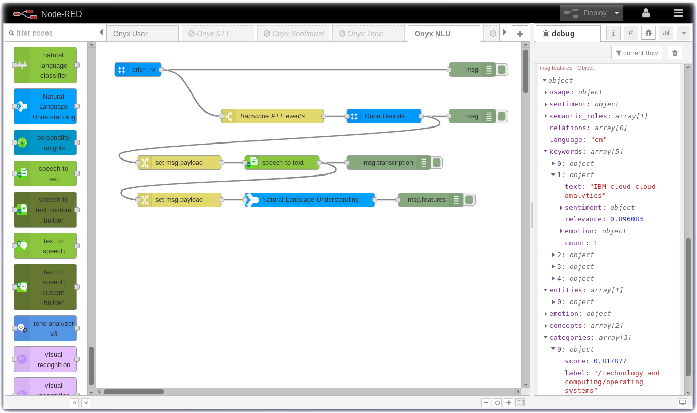

# Node-RED Example: Orion - Watson Natural Language Understanding

In this section you will connect the Orion Onyx using **Node-RED** and the [node-red-contrib-orion](https://flows.nodered.org/node/node-red-contrib-orion) nodes to the Natural Language Understanding analysis node.  The wav file will be transcribed into a text string and then the text will be sent to the Watson NLU analysis node.

Using the Watson Natural Language Understanding node, you can extract meta-data from content.

The following features are available for analysis:

- Categories, categorize content into a taxonomy.
- Concepts, recognize high-level concepts.
- Document Emotion, generate emotion scores.
- Emotion Targets, optionally target the emotions scores to a comma seperated list eg. apples,pears.
- Document Sentiment, generate sentiment scores.
- Sentiment Targets, optionally target the sentiment scores to a comma seperated list eg. dolphins,sharks.
- Entities, identify people, companies, organizations, cities, geographic features, and other typed entities.
- Keywords, discover topic keywords for content.
- Metadata, identify author name, title, RSS/ATOM feeds, publication date, etc.
- Relations, identify Subject-Action-Object relations.
- Semantic Roles, parse out sentences into subject, action, and object form.

### Natural Language Understanding analysis of the Onyx Messages

Download the [flow](flows/) and import it into your Node-RED Editor. 

---

[Home](/README.md) | [Node-RED](/PART1.md) | [Setup](/PART2.md) | [Onyx](/PART3.md) | [Connect](/PART4.md) | [Speech](/PART5.md) | [Sentiment](/PART6.md) | [Tone](/PART7.md) | **NLU** | [Translate](/PART9.md) | [SMS](/PART10.md) | [ChatBot](/PART11.md) | [Cloudant](/PART12.md) | [Map](/PART13.md) | [Blockchain](/PART14.md) 

---
